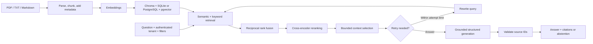

# Production RAG

A document question-answering application with hybrid retrieval, cross-encoder reranking, a bounded LangGraph workflow, and answers tied to source passages. Run real models locally with Ollama, or use OpenAI. The backend is FastAPI; the browser interface needs no separate build.

> Production-style, with explicit limits: use one API worker. Uploads are synchronous, and answers are serialized with document mutations. Evaluate on your own documents before deploying to users.

## How it works



Features include page/section metadata, exact duplicate detection, document versions, tenant-scoped filters, revision-aware response caching, rate and upload limits, request IDs, health checks, Prometheus metrics, optional LangSmith traces, and retrieval evaluation with Recall@K and MRR.

## Requirements

- Python 3.12 or 3.13 and [uv](https://docs.astral.sh/uv/getting-started/installation/).
- [Ollama](https://ollama.com/download) for local inference. Model downloads and the Python dependencies require disk space; a GPU helps.
- [Docker Desktop](https://docs.docker.com/desktop/setup/install/windows-install/) for the PostgreSQL or full container setup. On Windows, use Linux containers.

Commands below use PowerShell. Run them from the repository folder.

## 1. Install and configure local models

```powershell
git clone https://github.com/RiyanBhargava/production-rag.git
cd production-rag
uv sync --frozen
if (-not (Test-Path .env)) { Copy-Item .env.ollama.example .env }
ollama pull llama3:latest
ollama pull nomic-embed-text:latest
ollama list
```

Keep the Ollama desktop application running. If it is not already serving, start `ollama serve` in a separate terminal. Do not start a second server on the same port.

The example selects real local inference, 768-dimensional embeddings, Chroma, and a cross-encoder. Its `local-change-me` application key is for local development only. The first start also downloads the reranker. Ollama requires no paid LLM API key; hardware and hosting still have costs.

## 2. Start the API and use the interface

```powershell
uv run uvicorn app.main:create_app --factory --host 127.0.0.1 --port 8000
```

Open **http://127.0.0.1:8000**. Enter the application key from `API_KEYS` in your private `.env`, then connect. This is the key for this application, not an OpenAI or LangSmith key.

1. Upload `samples/employee-policy.txt`, version `1`, category `general`.
2. Wait for a successful upload showing the stored filename and chunk count.
3. Ask `How many days of annual leave do employees receive?`
4. Expand a citation and check the passage. The sample policy specifies 24 days.
5. Upload your own document and choose **Ask about this** in the library. Filters match exact filenames/categories.

API documentation is at **http://127.0.0.1:8000/docs**. Stop the API with **Ctrl+C**. Stored documents remain on disk. Restart with the same command and configuration.

## 3. Use PostgreSQL / pgvector

Generate two different secrets locally:

```powershell
uv run python -c "import secrets; print(secrets.token_hex(32)); print(secrets.token_hex(32))"
```

In `.env`, use the first as the app key and the second as the database password. Replace the placeholders below; do not include angle brackets. Hex passwords avoid URL-encoding issues.

```dotenv
APP_ENV=production
MODEL_MODE=ollama
STORAGE_BACKEND=postgres
EMBEDDING_DIMENSIONS=768
RERANKER_MODE=cross_encoder
API_KEYS={"<random-app-key>":"my-company"}
POSTGRES_PASSWORD=<different-random-db-password>
DATABASE_URL=postgresql+psycopg://rag:<different-random-db-password>@127.0.0.1:5432/rag
```

Keep the other Ollama settings from the example. Stop the API, then run:

```powershell
docker compose up -d postgres
docker compose ps
uv run uvicorn app.main:create_app --factory --host 127.0.0.1 --port 8000
```

This runs the API on your computer and PostgreSQL in Docker. Re-upload documents: switching stores does not migrate them. An embedding model/dimension change also requires a new store and re-ingestion. Do not delete your old store to resolve a configuration error.

### Run the API in Docker too

Stop the terminal API first, leave host Ollama running, then:

```powershell
docker compose -f compose.yaml -f compose.ollama.yaml up -d --build
docker compose -f compose.yaml -f compose.ollama.yaml ps
docker compose -f compose.yaml -f compose.ollama.yaml logs --tail 100 api
```

The override connects the API container to host Ollama through `host.docker.internal`. If that connection fails, configure Ollama to accept connections from Docker and restart it. Restrict access with your firewall; keep port 11434 private. The compose files publish the API/database only to localhost.

```powershell
# Stop containers, keeping them and their data
docker compose -f compose.yaml -f compose.ollama.yaml stop
# Start existing containers again
docker compose -f compose.yaml -f compose.ollama.yaml start
# Remove containers/network while retaining named volumes
docker compose -f compose.yaml -f compose.ollama.yaml down
```

The database uses the `postgres-data` named volume. Do not add `-v` to `down` unless you deliberately want to delete stored data. Back up and test restoration before deployment.

## Providers and tracing

| Option | Implemented here | Credentials |
|---|---|---|
| Ollama | Real chat + local embeddings | No LLM provider key |
| OpenAI | Chat + embeddings | `OPENAI_API_KEY` |
| Demo | Deterministic embeddings and retrieved excerpts; no LLM | None |
| Gemini / Grok | Not implemented | A key alone will not enable these |

For OpenAI, set `MODEL_MODE=openai`, `OPENAI_API_KEY`, `CHAT_MODEL`, `EMBEDDING_MODEL`, and matching `EMBEDDING_DIMENSIONS`. Use a new store when changing embedding configuration. Model names and quotas should be checked in your provider account.

**LangSmith is implemented and opt-in.** Add these to private `.env`, restart, and make a query:

```dotenv
LANGSMITH_TRACING=true
LANGSMITH_API_KEY=<your-langsmith-key>
LANGSMITH_PROJECT=production-rag
TRACE_CONTENT=false
```

Graph and LangChain model runs appear in the project. Inputs/outputs are hidden by default. Enable `TRACE_CONTENT=true` only when you intend to send questions and document passages to LangSmith. Parsing and SQL operations are not independently instrumented spans. Token usage depends on model reporting; local inference is not a hosted provider bill.

Gemini and Grok can also be traced through their [Google](https://docs.langchain.com/oss/python/integrations/chat/google_generative_ai) and [xAI](https://docs.langchain.com/oss/python/integrations/chat/xai) LangChain integrations after adding and testing provider adapters. See [LangSmith tracing](https://docs.langchain.com/langsmith/trace-with-langchain).

## API

All document/query/metrics routes require `X-API-Key`. The key maps to a server-controlled tenant; clients cannot choose another tenant in a request.

| Method | Path | Purpose |
|---|---|---|
| POST | `/documents` | Multipart upload: `file`, `version`, `category` |
| GET | `/documents` | List this tenant's document versions |
| DELETE | `/documents/{document_id}` | Delete one of this tenant's documents |
| POST | `/query` | JSON question and optional filters |
| GET | `/health/live` | Process liveness |
| GET | `/health/ready` | Storage and local model availability |
| GET | `/metrics` | Authenticated Prometheus metrics |

Example JSON for `/query`:

```json
{
  "question": "What does SEC-401 mean?",
  "filters": {"filename": "employee-policy.txt", "category": "general"}
}
```

Supported filters also include `version` and `document_ids`. Queries use active versions by default. Responses contain `answer`, `citations`, `insufficient_evidence`, `reason`, `mode`, and `cached`. A citation includes a source ID, filename, page, section, version, and excerpt.

## Code map

| File | Responsibility |
|---|---|
| `app/config.py` | Settings and production validation |
| `app/documents.py` | PDF/TXT/Markdown parsing, metadata, splitting, chunk deduplication |
| `app/storage.py` | SQL catalog, versions, tenant filtering, vector + keyword retrieval |
| `app/pipeline.py` | Model adapters, fusion, reranking, graph, evidence validation |
| `app/main.py` | API, auth, limits, cache, health, metrics, static serving |
| `static/index.html`, `styles.css`, `app.js` | Browser interface, styling, interactions |
| `scripts/export_chunks.py` | Export persistent chunk IDs for evaluation labels |
| `scripts/evaluate.py` | Semantic/keyword/fused/reranked Recall@K and MRR; optional generation |
| `scripts/demo_evaluation.py` | Isolated sample evaluation |
| `scripts/verify_local.py` | Actual Ollama/reranker smoke checks in a temporary local store |
| `tests/` | API, tenant isolation, provider validation, citations, parsing, retrieval regressions |
| `.github/workflows/checks.yml` | CI with a real pgvector database |
| `Dockerfile`, `compose*.yaml` | Container image and deployment definitions |
| `pyproject.toml`, `uv.lock` | Dependencies and reproducible versions |
| `.env*.example` | Public configuration templates; not real credentials |

## Test and evaluate

```powershell
uv run pytest -q
uv run ruff check app tests scripts
uv run ruff format --check app tests scripts
uv run python -m scripts.demo_evaluation
uv run python -m scripts.verify_local
```

Ordinary tests use fake/demo models and do not spend API credits. The local verification requires running Ollama and checks supported and unsupported sample questions. The PostgreSQL test runs only when `TEST_DATABASE_URL` is set; CI supplies it. Use a dedicated test database.

For your own documents, export chunks, label relevant IDs by reading the passages, then evaluate:

```powershell
New-Item -ItemType Directory -Force data | Out-Null
uv run python -m scripts.export_chunks --tenant my-company | Out-File -Encoding utf8 data/chunks.jsonl
uv run python -m scripts.evaluate data/questions.jsonl --tenant my-company --k 5 --output data/evaluation.json
```

Each dataset line is a JSON object:

```json
{"question":"What does SEC-401 mean?","filters":{"category":"general"},"relevant_chunk_ids":["actual-chunk-id"],"expected_answer_terms":["certificate"]}
```

Add `--generate` to evaluate answers too; hosted models may incur charges. Answer term recall is a smoke metric, not proof of correctness. Review grounding, completeness, citation support, and abstention on your real data.

## Operational boundaries

- PDF extraction handles text PDFs, not OCR or reliable table reconstruction.
- Local keyword retrieval is BM25; PostgreSQL uses English full-text search, which is not BM25.
- PostgreSQL vector queries currently use exact search over eligible tenant/filter rows. HNSW is created but is not used by that query shape; benchmark before scaling.
- SQL tenant predicates enforce application access. Enabled RLS with no public policies blocks ordinary Supabase API access, but the backend database owner can bypass RLS. It is not per-user JWT/RLS authorization.
- Citation IDs are validated; this does not mathematically verify every claim against its passage. Human evaluation remains necessary.
- One process holds cache/rate limits/locks. Multiple workers/replicas require shared coordination and consistent database snapshots.
- No background ingestion queue, OCR, enterprise login, managed migrations, automatic freshness scheduler, backup automation, or public TLS proxy is bundled.

Before public use: add HTTPS and your identity layer, use restricted database roles and secrets management, test restore procedures, evaluate tenant isolation and quality, measure load/latency, and configure alerting. Supabase can host PostgreSQL/pgvector; use its private SQL connection, not a public browser database key.

## Troubleshooting

| Symptom | Check |
|---|---|
| No evidence after uploading | Confirm the successful response names the intended file; inspect library, active version, exact filters and extracted text |
| 401 | Use the app key from `API_KEYS`, not a provider key |
| 409 upload | Same filename/version has different content; use a new version |
| 503 readiness | PostgreSQL connection, running Ollama, downloaded model tags |
| Embedding configuration changed | Use a new store and re-ingest; keep the old store backed up |
| Port 8000 in use | Stop the existing API/container before starting another |
| LangSmith has no traces | Enable tracing, supply its own key/project, restart, then make an uncached query |

Secrets, document stores, uploads, caches, logs, virtual environments, and local learning documents are excluded from Git. Only this README is published as Markdown.
